# Proyecto Pong Online Multiplayer con Django

¡Bienvenido al emocionante mundo de Pong online! 🏓 Este proyecto busca crear una experiencia de juego única y sin lag utilizando Django como backend. A continuación, encontrarás recomendaciones clave para que tu desarrollo sea un éxito.

<details>
<summary><strong>1. Utilizar Django para el Backend</strong></summary>
Aprovecha la robustez de Django para desarrollar la lógica del servidor y gestionar la base de datos. 🌐
</details>

<details>
<summary><strong>2. Implementar Microservicios</strong></summary>
Diseña el backend con microservicios para modularidad y escalabilidad. Puedes considerar herramientas como Docker y Kubernetes para la implementación de microservicios. 🚀
</details>

<details>
<summary><strong>3. Aplicar Prácticas de Seguridad</strong></summary>
Utiliza HTTPS y prácticas de seguridad como las proporcionadas por Django, y considera el uso de herramientas como Let's Encrypt para certificados SSL. 🔒
</details>

<details>
<summary><strong>4. Manejar Contraseñas y Credenciales</strong></summary>
Almacena credenciales en un archivo `.env` seguro y excluido de versiones. Puedes utilizar la librería `python-decouple` para gestionar variables de entorno. 🔑
</details>

<details>
<summary><strong>5. Usar Django Channels para Tiempo Real</strong></summary>
Habilita comunicación en tiempo real con Django Channels para interacción entre jugadores y actualizaciones del juego. ⚙️
</details>

<details>
<summary><strong>6. Optar por WebSockets para Multijugador</strong></summary>
Utiliza WebSockets a través de Django Channels para facilitar la comunicación bidireccional entre el servidor y los clientes. Considera también bibliotecas como `django-websocket-redis` para manejar la escalabilidad. 🔄
</details>

<details>
<summary><strong>7. Optimizar Código Python</strong></summary>
Escribe código Python eficiente y optimiza consultas a la base de datos. Utiliza herramientas de perfilado como `Django Debug Toolbar` para identificar áreas de mejora. 🐍
</details>

<details>
<summary><strong>8. Implementar Matchmaking Eficiente</strong></summary>
Desarrolla un sistema de matchmaking eficiente utilizando algoritmos que consideren habilidades y latencia. Puedes explorar bibliotecas como [elo Rating](https://pypi.org/project/elo-rating/) o  [TrueSkill](https://trueskill.org/) para el matchmaking basado en habilidades. 🎮
</details>


<details>
<summary><strong>9. Optimizar Gráficos y Recursos</strong></summary>
Utiliza tecnologías como ThreeJS/WebGL para gráficos 3D avanzados y optimiza los recursos gráficos. 🖌️
</details>

<details>
<summary><strong>10. Desarrollar Sistema Anti-Lag</strong></summary>
Implementa técnicas como predicción del servidor, interpolación y otras estrategias de mitigación del lag. Considera el uso de bibliotecas como `pygame` para mejorar la sincronización. ⚙️
</details>

<details>
<summary><strong>11. Realizar Pruebas de Estrés y Rendimiento</strong></summary>
Utiliza herramientas como `Locust` para realizar pruebas de estrés y `Django Silk` para el monitoreo del rendimiento. 🧪
</details>

<details>
<summary><strong>12. Escalabilidad del Sistema</strong></summary>
Diseña el sistema con la escalabilidad en mente. Utiliza servicios en la nube como AWS o Google Cloud y considera la implementación de un balanceador de carga. 🚀
</details>

<details>
<summary><strong>13. Documentar y Versionar el Código</strong></summary>
Documenta el código utilizando docstrings y usa Git para el control de versiones. Puedes explorar plataformas como GitHub para la colaboración. 📚
</details>

<details>
<summary><strong>14. Seguir el Ciclo de Desarrollo Ágil</strong></summary>
Adopta metodologías ágiles como Scrum o Kanban para una entrega iterativa y priorización efectiva de características. 🔄
</details>

<details>
<summary><strong>15. Monitorización y Registro</strong></summary>
Implementa sistemas de monitorización como `Prometheus` y registra eventos con `ELK Stack` para identificar y solucionar problemas de rendimiento en tiempo real. 📊
</details>

<details>
<summary><strong>16. Seleccionar un Framework Frontend</strong></summary>
Elige un framework frontend que se adapte a tus necesidades. Puedes considerar opciones populares como [Material Design With Bootstrap](https://saurav.tech/mdbsvelte/?path=/story/intoduction--getting-started) o [Bootstrap](https://getbootstrap.com/), que ofrecen componentes y estilos predefinidos para un diseño atractivo y responsive.
</details>
  ---

### ¡A por el 125 ✨✨✨!

Cada línea de código te acerca más al 125. ¡Atrévete a soñar en grande y diviértete desarrollando este emocionante proyecto! 🏓✨


# UML Diagrams

<details>
<summary><strong>Class Diagrams</strong></summary>

### Backend Class Diagram

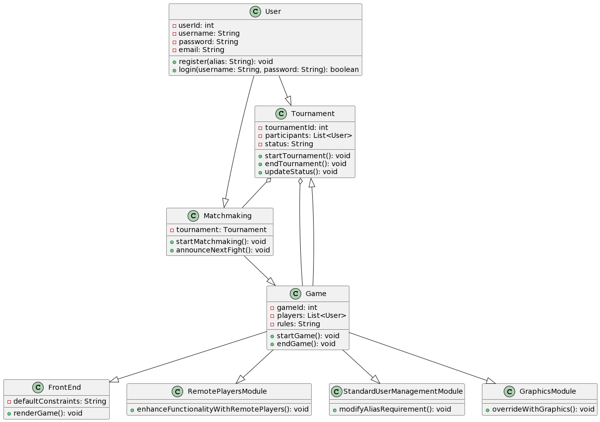

### Gameplay Class Diagram

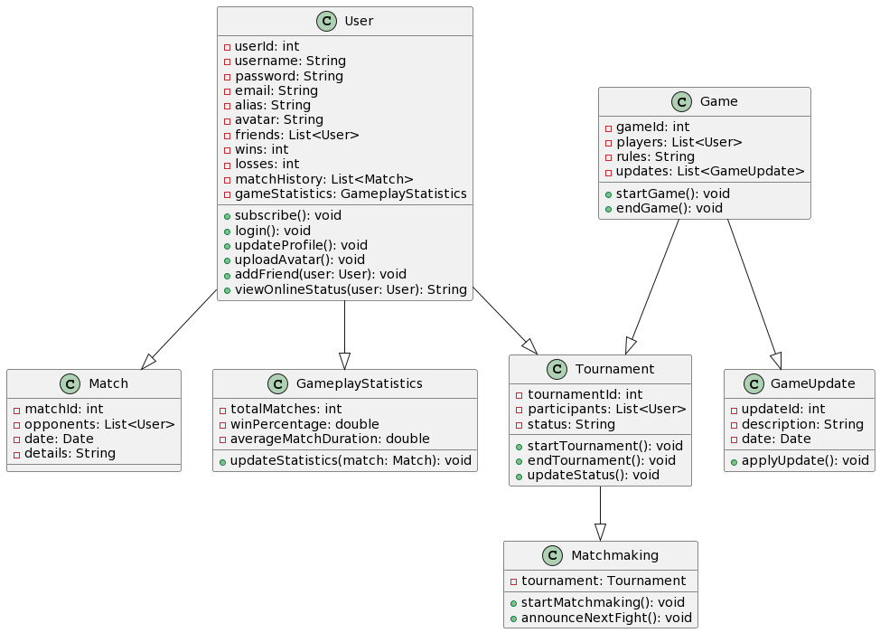

### Security Class Diagram

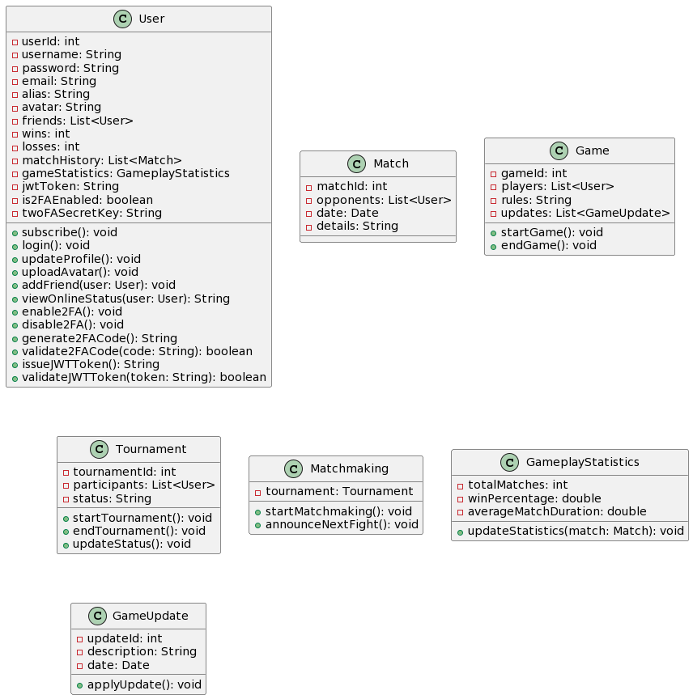

### Graphics Class Diagram

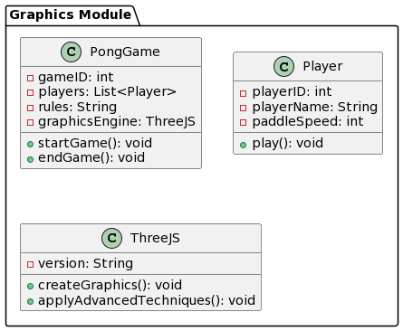

### User Class Diagram

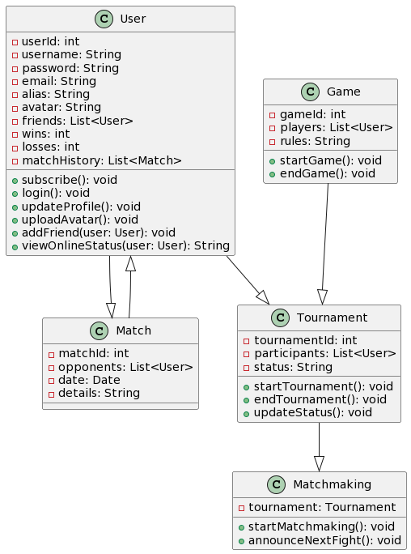

</details>

<details>
<summary><strong>Component Diagrams</strong></summary>

### Backend Component Diagram

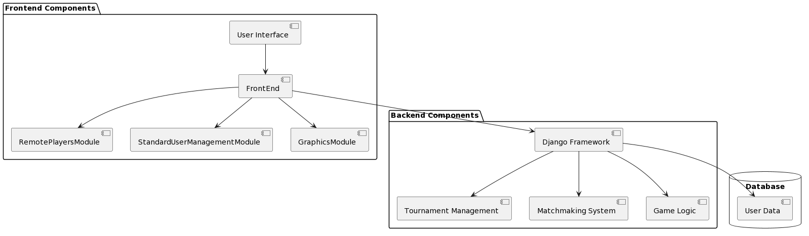

### DevOps Component Diagram


### Gameplay Component Diagram

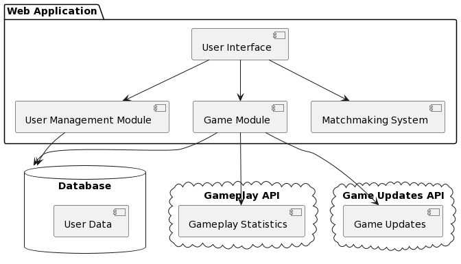

### Security Component Diagram

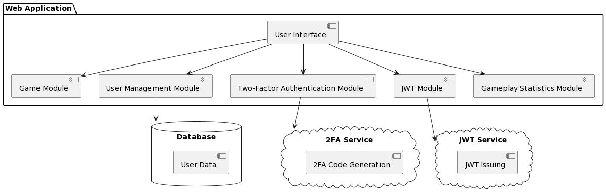

### Graphics Component Diagram

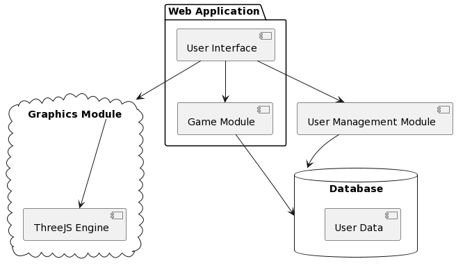

### User Component Diagram

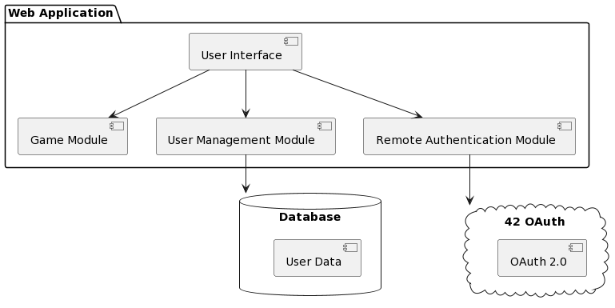

</details>

<details>
<summary><strong>Sequence Diagrams</strong></summary>

### Backend Sequence Diagram

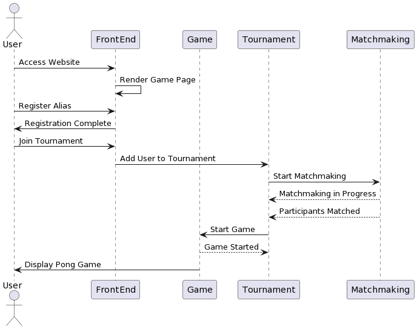

### Gameplay Sequence Diagram

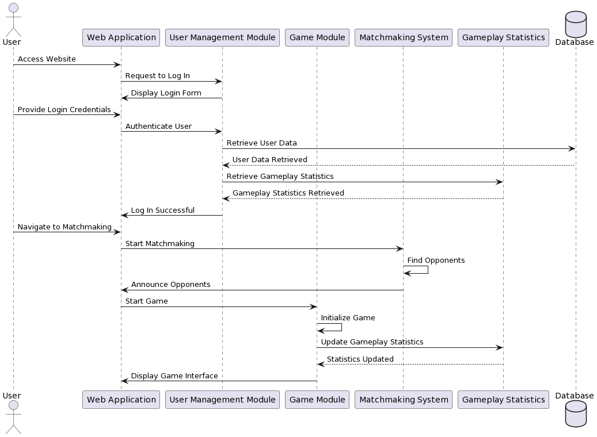

### Security Sequence Diagram

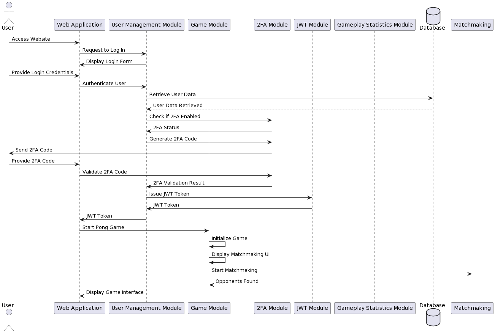

### Graphics Sequence Diagram

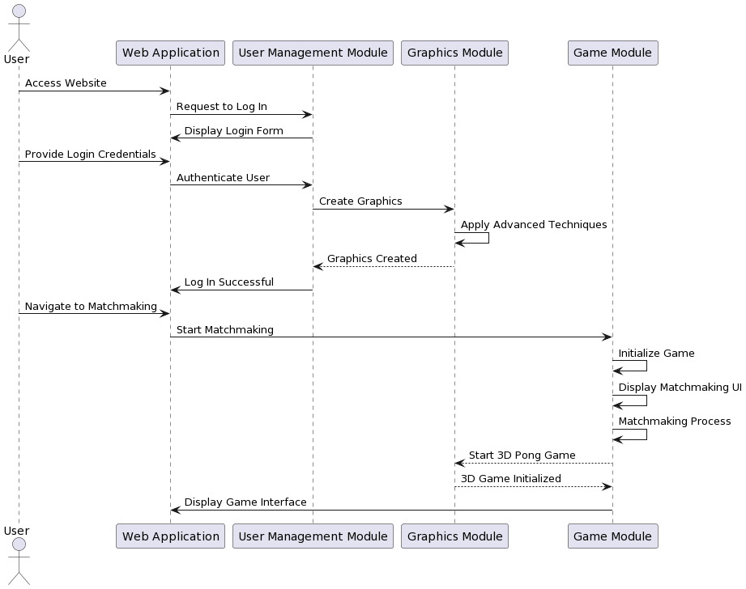

### User Sequence Diagram

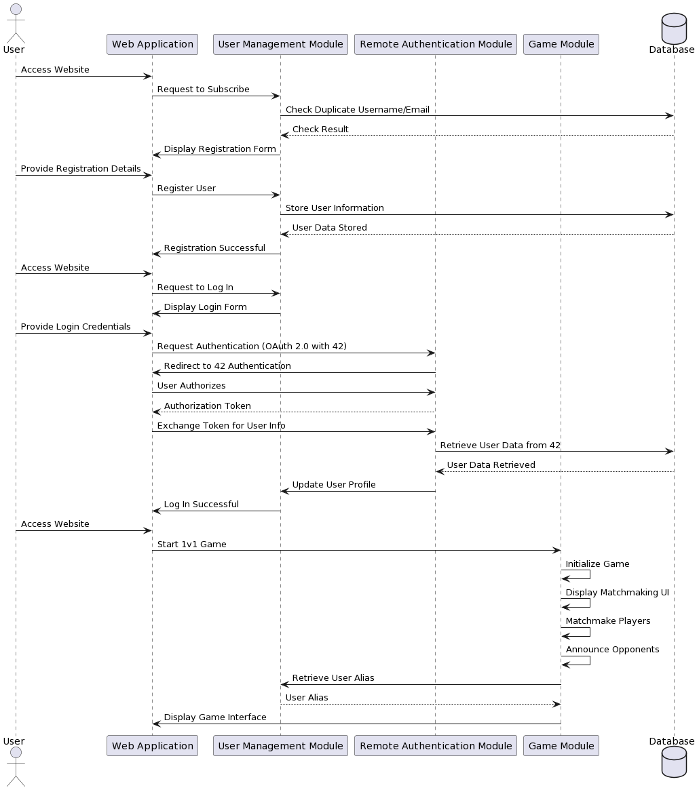

</details>


# Django
## _Static Files_

# Information on how to configure static files and hot reload
- [Whitenose Link](https://whitenoise.readthedocs.io/en/latest/django.html)
-  [livesync](https://github.com/fabiogibson/django-livesync)
-  [Django-Extensions](https://django-extensions.readthedocs.io/en/latest/)
Django Extensions es una colección de extensiones personalizadas para Django Framework.Estos incluyen comandos de administración, campos de bases de datos adicionales, extensiones de administración y mucho más.
- [Werkzeug](https://werkzeug.palletsprojects.com/en/3.0.x/)

## Tech

- Whitnoise:
En el archivo principal setting.py añadimos:
WHITENOISE_AUTOREFRESH = True  # Habilita la actualización en tiempo real para archivos estáticos

- django-extensions:
django-extensions es una biblioteca de terceros para Django que proporciona un conjunto de utilidades y comandos adicionales para facilitar el desarrollo. Incluye características como comandos de shell mejorados, manejo de archivos, generadores de códigos y más.

- livesync:
django-livesync es una extensión de django-extensions que agrega la capacidad de recargar automáticamente el servidor de desarrollo de Django cuando se detectan cambios en el código fuente. Esto facilita la visualización inmediata de los efectos de los cambios sin necesidad de reiniciar manualmente el servidor. La opción --livesync se utiliza al ejecutar el servidor de desarrollo para habilitar esta funcionalidad de recarga en tiempo real.

- Werkzeug:
Depurador para django con las siguientes funciones:
Principales características de Werkzeug:

  - **Servidor de Desarrollo:** Proporciona un servidor de desarrollo que facilita la ejecución y prueba de aplicaciones web durante el desarrollo local. Incluye recarga automática del servidor cuando hay cambios en el código fuente.

  - **Depurador Interactivo:** Ofrece un depurador interactivo que se activa en caso de errores, proporcionando información detallada sobre el estado de la aplicación en el momento del error.

  - **Manejo de Solicitudes y Respuestas HTTP:** Contiene utilidades para manejar solicitudes y respuestas HTTP, facilitando la construcción de aplicaciones web.

  - **Utilidades Generales:** Incluye varias utilidades que son útiles para el desarrollo web, como manipulación de URL, manejo de cookies, y más.


## Requirements django


For installation in docker...

```sh
pip install -r requirements.txt
```
or
```sh
pip3 install -r requirements.txt
```
| Package | version |
| ------ | ------ |
| django-rest-framework | 0.1.0 |
| gunicorn | 21.2.0 |
| whitenoise | 6.6.0 |
| django-livesync | 0.5 |
| django-extensions | 3.2.3 |
| Werkzeug | 3.0.1 |

## Docker

- FROM python:3.8: Utiliza la imagen oficial de Python 3.8 como base para tu imagen.

- ENV DockerHOME=/home/app/webapp: Establece una variable de entorno llamada DockerHOME con el valor /home/app/webapp.

- RUN mkdir -p $DockerHOME: Crea el directorio especificado por DockerHOME y sus subdirectorios, si es necesario.

- WORKDIR $DockerHOME: Establece el directorio de trabajo actual dentro del contenedor.

- ENV PYTHONDONTWRITEBYTECODE 1 y ENV PYTHONUNBUFFERED 1: Establecen variables de entorno para la configuración de Python, como se explicó en respuestas anteriores.

- RUN pip install --upgrade pip: Actualiza la herramienta pip a la última versión.

- COPY . $DockerHOME: Copia el contenido del directorio actual (donde se encuentra el Dockerfile) al directorio especificado por DockerHOME dentro del contenedor.

- RUN pip install -r requirements.txt: Instala las dependencias de Python especificadas en el archivo requirements.txt.

- EXPOSE 8000: Informa a Docker que el contenedor escuchará en el puerto 8000. Esto es más una documentación para el usuario que ejecuta el contenedor y no tiene un impacto directo en la red del contenedor.

- CMD python manage.py runserver: Especifica el comando predeterminado que se ejecutará cuando el contenedor se inicie. En este caso, se inicia el servidor de desarrollo de Django.

  -  PYTHONDONTWRITEBYTECODE=1: Evita que Python genere archivos de bytecode (.pyc) al importar módulos. Estos archivos no son necesarios en entornos de contenedor y desarrollo, y desactivarlos puede reducir el tamaño del contenedor.

  - PYTHONUNBUFFERED=1: Deshabilita el búfer de salida en Python, asegurando que la salida esté disponible de inmediato en la consola. Esto es útil para obtener logs y mensajes de salida sin esperar a que se llene un búfer, especialmente en entornos de contenedor y desarrollo.
